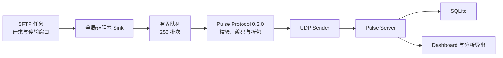

# FluxTerm SFTP 性能遥测实现说明

## 1. 当前架构

遥测代码仅进入启用 `performance-telemetry` Cargo feature 和 `telemetry` Vite mode 的开发者构建。采集端复用现有业务流水线聚合数据，再通过单一 UDP Worker 发送到 Pulse Server。



## 2. 模块职责

| 模块 | 职责 |
| --- | --- |
| `fluxterm-pulse-protocol` | 共享 v1 消息模型、流类型、参数规则和指标目录 |
| `crates/performance_telemetry` | 统一采集 API、指标构造、协议编码和禁用态 no-op |
| `src-tauri/src/performance_telemetry.rs` | 配置、设备身份、流注册表、队列、UDP Worker 和状态计数 |
| `crates/engine/src/sftp.rs` (`fluxterm-engine`) | SFTP 任务分类、窗口化传输和任务级指标 |

Tauri 启动时读取配置并创建稳定设备身份，随后安装全局 Sink。业务模块通过统一 API 打开流、提交聚合窗口并关闭流，无需感知 UDP 或 JSON 编码。

## 3. SFTP 采集

上传任务在创建性能流之前检查所有根路径，并分类为文件、目录或批量上传。下载按文件和目录建立对应流。每条流报告实际 `chunkSizeBytes`、`requestWindow` 和 `workerCount`。

上传和下载默认使用 256 KiB 分块，并按服务端 `write_limit` 或 `read_limit` 收缩。单文件传输使用一个文件 Worker 和最多 8 个并发偏移请求；目录任务使用 8 个文件 Worker，每个文件维持自己的请求窗口。

下载结果可以乱序返回，任务使用 `BTreeMap` 暂存数据并只按连续偏移写入。短读会生成精确补读请求，结束时检查 EOF 和最终文件大小。取消或失败时终止活动请求并清理不完整目标文件。

遥测在原始 SFTP 请求完成时记录真实请求数和耗时，在目标写入成功后累计传输字节。所有 Worker 共享任务级在途请求与待写块计数，因此高水位反映整个任务的实际并发。

## 4. 发送与故障隔离

Tauri 使用容量为 256 的同步队列和 `try_send` 接收业务批次。单一 Worker 负责协议校验、1200 字节拆包、流内序列号和 UDP 发送。队列满时丢弃新批次，并在状态计数中记录；业务线程不等待网络。

配置缺失时不会创建 Socket 或 Worker。发送目标不存在时，UDP 发送保持尽力而为，错误只更新计数和运行日志。应用退出时，Worker 为仍打开的流生成 `disconnected`，并最多等待 100 ms 完成刷新。

## 5. 开发与验证

遥测开发构建：

```powershell
pnpm dev:telemetry
pnpm build:telemetry
```

核心检查：

```powershell
pnpm performance-telemetry:check
cargo test --workspace --all-features
cargo clippy --all-targets --all-features -- -D warnings
pnpm web:build:telemetry
```

协议行为由共享协议库测试覆盖；FluxTerm 测试重点覆盖快照拆包、SFTP 分类与窗口化传输、请求生命周期、短读补读、乱序写入和取消清理。端到端验证可在 Pulse Server 中核对流类型、参数、请求窗口、传输字节和分析导出结果。
